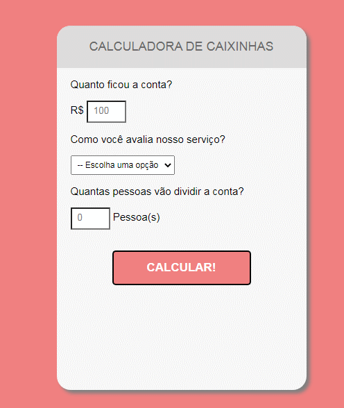

<h1 align="center"><strong>🪙 Calculate Tip 🪙</strong></h1>

<h2 align="center"><strong>What it is?</strong></h2>

It is a simple calculate tip   In this project I used the technologies that are the pillars of the web. In it I put into practice fundamental principles that made me understand more easily how a modern website application works.
 

<h2 align="center"><strong>Desktop WebSite 👨‍💻</strong></h2> 

 <h2 align="center"><strong>Made with care with these tools 🛠 : </strong></h2> 

 HTML5 & CSS3, JavaScript ES6 

